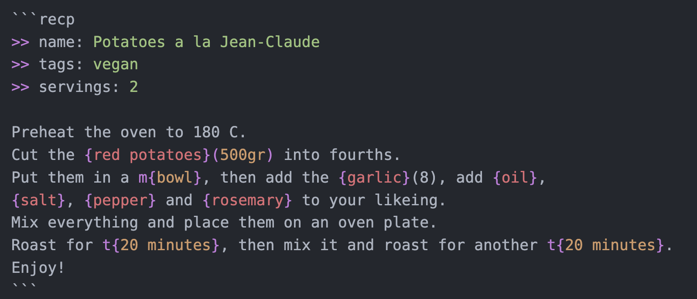

# recipe-lang

Extension that adds syntax highlight for [recipe-lang](https://github.com/reciperium/recipe-lang).

## Features

- Syntax highlight for `.recp` files
- Markdown block support (```recp)




**Enjoy!**
